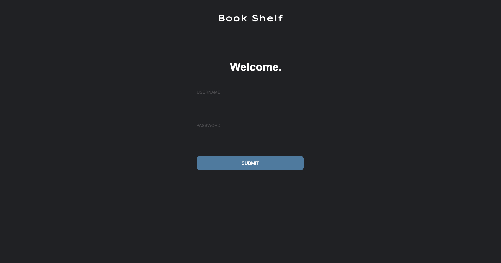
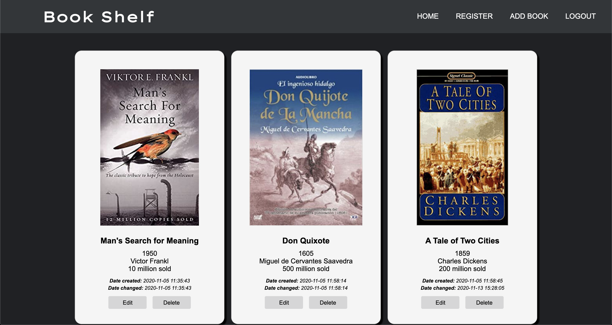
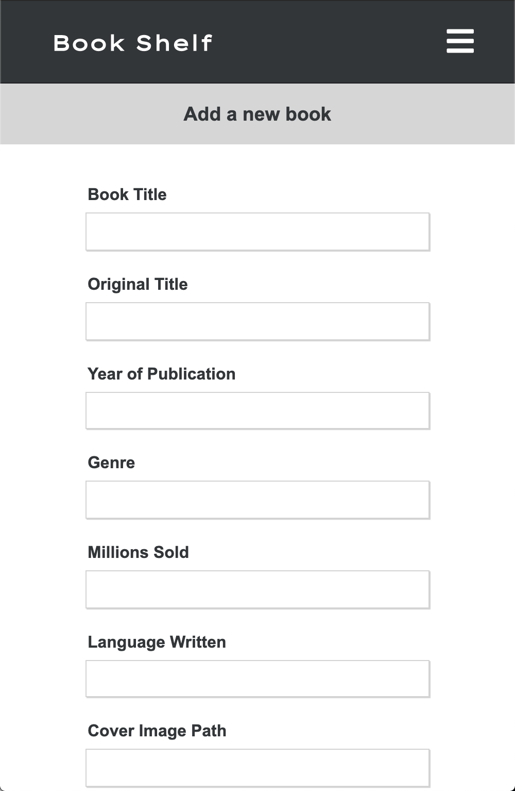

# 📚 bookshelf 📚
An easy-to-use CRUD web application that uses a MySQL database to store the top selling books of all time.
By querying the database through the front-end users can create book entries, display all entries, update specific book entries and author information and delete stored books of their choosing.

**Technologies used -**
* HTML, CSS and JavaScript for the frontend
* Vanilla PHP for the backend using an MVC design pattern
* SQL to query a MySQL database

**Screenshots -**

